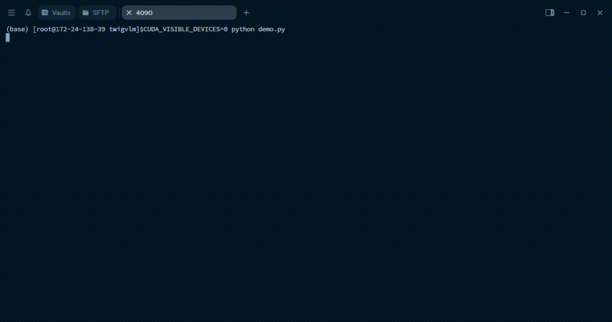

# TwigVLM

[[📖 Technical report]()\]&nbsp;&nbsp;&nbsp;&nbsp;[[🤗Huggingface]()\]

This repository contains the official training/evaluation code of the [TwigVLM paper](https://arxiv.org/abs/2503.14075) (accepted by ICCV '25).
TwigVLM is a simple yet framework to accelerate inference of large visual language models (LVLMs) by “growing” a lightweight twig block on top of an early layer of the base VLM.

Compared with existing VLM acceleration methods purely based on visual token pruning, our TwigVLM not only enjoys better accuracy retention by employing a twig guided token pruning (TTP) strategy, but also yields higher generation speed by utilizing a self-speculative decoding(SSD) strategy.

## Table of Contents
- [TwigVLM](#twigvlm)
  - [Table of Contents](#table-of-contents)
  - [News](#news)
  - [Highlights](#highlights)
  - [Demo](#demo)
  - [Prerequisites](#prerequisites)
  - [Model-zoo](#model-zoo)
  - [Training](#training)
  - [Evaluation](#evaluation)
  - [License](#license)
  - [About us](#about-us)
  - [Citation](#citation)
  
## News
- July 5, 2025: Training and evaluation codes of the `TwigVLM` model are released.

## Highlights
<p align="center" width="80%">

</p>

1. Our TwigVLM, when applied on LLaVA-7B following other acceleration methods, achieves state-of-the-art performance w.r.t accuracy retention. By pruning 88.9% of visual tokens, it retains 96% of the original performance.
   
2. Our TwigVLM demonstrates a remarkable acceleration in generating long responses, achieving a 154% improvement in speed compared to the native LLaVA model. 
   
3. The training of the twig block is considerably efficient, which takes only 1/10 duration of the original LLaVA model's finetuning stage.
   
5. Moreover, by implementing the KVCache reuse mechanism, we have effectively eliminated computational redundancy, thereby enhancing overall efficiency.
  
## Demo

The tokens highlighted in green are generated by the draft model.

<p align="center" width="100%">

</p>

## Prerequisites

1. Clone this repository and navigate to the folder 
``` shell
git clone git@github.com:ricar0/twigvlm.git
cd twigvlm
```
2. Install Package

We recommend using [Anaconda](https://www.anaconda.com/) to create a new environment for the project, and install the requirements with the following commands:
``` shell
conda create -n twigvlm python=3.10 -y
conda activate twigvlm
pip install -r requirements.txt
pip install flash-attn==2.3.2 --no-build-isolation
``` 
<!-- 3. Download the pretrained base models (i.e., Phi-2 and SigLIP) to your local directories. (optional)
``` shell
python scripts/download_models.py
```
The base models will be stored in `checkpoints/base` in default.
```
checkpoints
└── base
    └── siglip-so400m-patch14-384
    └── phi-2
``` -->
## Model-zoo
You can download the checkpoints of the twig in [huggingface]().


If you want to train an twig from scratch, please refers to [Training](#training).


## Training
The training pipeline and datasets of our TwigVLM models are directly inherited from [LLaVA-v1.5](https://github.com/haotian-liu/LLaVA). 

## Evaluation
We follow the evaluation of [LLaVA-v1.5](https://github.com/haotian-liu/LLaVA/tree/main). 

Before preparing task-specific data, you should download [eval.zip](https://drive.google.com/file/d/1atZSBBrAX54yYpxtVVW33zFvcnaHeFPy/view?usp=sharing) and unzip it to `./playground/data/eval`. For more specific instructions, please refer to [LLaVA's Evaluation.md](https://github.com/haotian-liu/LLaVA/blob/main/docs/Evaluation.md). 

E.g. Example for evaluating GQA results (default 192 tokens):
```
CUDA_VISIBLE_DEVICES=0,1,2,3,4,5,6,7 bash scripts/v1_5/eval/gqa.sh
```

If you want to eval some case, just simply add some configs as shown below:

**Loading weights**

``` python
tokenizer, model, image_processor, context_len = load_pretrained_model(
    model_path=model_path,
    model_base=None,
    model_name=get_model_name_from_path(model_path),
    twig=twig
)

```

**Twig Config**

```python
twigvlm_config = {
    "enable_FastV": True, 
    "attention_rank": 41, # retain visual tokens
    "generation_strategy": "self_speculative" # self_speculative | autoregressive
}

cont = model.generate(
    input_ids,
    images=image_tensor.unsqueeze(0).half().cuda(),
    do_sample=False,
    temperature=0,
    max_new_tokens=1024,
    eos_token_id=tokenizer.eos_token_id, # required
    image_sizes=image_sizes,
    twigvlm_config=twigvlm_config
)
text_outputs = tokenizer.batch_decode(cont.predicted_tokens, skip_special_tokens=True)[0]

```

Using our provided model, you can reproduce the following results. 

| Models | GQA | MME | MMBench | SQA(IMG) | TextVQA | VQAv2  | Avg |
|:--------:|:----:|:----:|:--------:|:--------:|:-----:|:----:|:-------:|
| [SparseVLM](https://github.com/Gumpest/SparseVLMs) | 57.6 | 1721 | 62.5 | 69.1 | 56.1 | 75.6 | 95.7% |
| [MustDrop](https://github.com/liuting20/MustDrop) | 58.2	| 1787 | 62.3 |	69.2 | 56.5	| 76 | 96.6% |
| [VisionZip](https://github.com/dvlab-research/VisionZip) | 59.3 | 1783 |63 | **68.9**	| 57.3 | 76.8	| 97.4% |
| [VisionZip*](https://github.com/dvlab-research/VisionZip) | 60.1	| 1834 | 63.4 | 68.2 | 57.8 |	77.4 | 98.3% |
| [**TwigVLM**](#) | **61.2** | **1848**| **64** | **68.9** | **58**  | **78.1** | **99.2%** |


## License
This project is licensed under the Apache License 2.0 - see the [LICENSE](https://www.apache.org/licenses/LICENSE-2.0) file for details.

## About us
This project is maintained by the [MILVLG](https://github.com/MILVLG) @ Hangzhou Dianzi University (HDU).  

## Citation

If you use our model or refer our work in your studies, please cite:

```bibtex
@article{shao2025growing,
  title={Growing a twig to accelerate large vision-language models},
  author={Shao, Zhenwei and Wang, Mingyang and Yu, Zhou and Pan, Wenwen and Yang, Yan and Wei, Tao and Zhang, Hongyuan and Mao, Ning and Chen, Wei and Yu, Jun},
  journal={arXiv preprint arXiv:2503.14075},
  year={2025}
}
```
