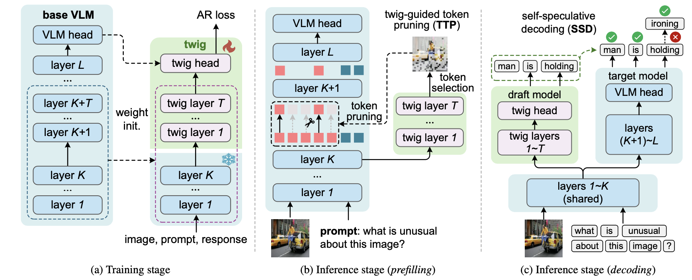

# TwigVLM

[[📖 Technical report]()\]&nbsp;&nbsp;&nbsp;&nbsp;[[🤗Huggingface]()\]

This repository contains the official training/evaluation code of the TwigVLM, which is a simple and general architecture by “growing” a lightweight twig on top of an early layer of the base VLM.

Compared with existing VLMacceleration methods purely based on visual token pruning, our TwigVLM not only enjoys better accuracy retention by employing a twig guided token pruning (TTP) strategy, but also yields higher generation speed by utilizing a self-speculative decoding(SSD) strategy.

## Table of Contents

  - [News](#news)
  - [Highlights](#highlights)
  - [Demo](#demo)
  - [Prerequisites](#prerequisites)
  - [Model-zoo](#model-zoo)
  - [Training](#training)
  - [Evaluation](#evaluation)
  - [License](#license)
  - [About us](#about-us)
  - [Citation](#citation)
  
## News
- March 15, 2025: Training and evaluation codes of the `TwigVLM` model are released.

## Highlights
<p align="center" width="80%">

</p>

1. Our TwigVLM achieves state-of-the-art performance among LLaVA-Based methods.By pruning 88.9% of visual tokens, it retains 96% of the original performance.
   
2. Our TwigVLM demonstrates a remarkable acceleration in generating long sentence responses, achieving a 154% improvement in speed compared to the native LLaVA model. 
   
3. Moreover, the training time is considerably more efficient, being only one-sixth of the original LLaVA model's finetune duration.
4. By implementing the KVCache reuse mechanism, we have effectively eliminated computational redundancy, thereby enhancing overall efficiency.
  
## Demo

## Prerequisites

1. Clone this repository and navigate to the folder 
``` shell
git clone git@github.com:ricar0/twigvlm.git
cd twigvlm
```
2. Install Package

We recommend using [Anaconda](https://www.anaconda.com/) to create a new environment for the project, and install the requirements with the following commands:
``` shell
conda create -n twigvlm python=3.10 -y
conda activate twigvlm
pip install -r requirements.txt
pip install flash-attn==2.4.2 --no-build-isolation
``` 
<!-- 3. Download the pretrained base models (i.e., Phi-2 and SigLIP) to your local directories. (optional)
``` shell
python scripts/download_models.py
```
The base models will be stored in `checkpoints/base` in default.
```
checkpoints
└── base
    └── siglip-so400m-patch14-384
    └── phi-2
``` -->
## Model-zoo
You can download the checkpoints of the twig in [huggingface]().


If you want to train an twig from scratch, please refers to [Training](#training).


## Training
The training pipeline and datasets of our TwigVLM models are directly inherited from [LLaVA-v1.5](https://github.com/haotian-liu/LLaVA). 

## Evaluation
We follow the evaluation of [LLaVA-v1.5](https://github.com/haotian-liu/LLaVA/tree/main). 

Before preparing task-specific data, you should download [eval.zip](https://drive.google.com/file/d/1atZSBBrAX54yYpxtVVW33zFvcnaHeFPy/view?usp=sharing) and unzip it to `./playground/data/eval`. For more specific instructions, please refer to [LLaVA's Evaluation.md](https://github.com/haotian-liu/LLaVA/blob/main/docs/Evaluation.md). 

Before evaluation, simply add some configs as shown below:

**Loading weights**

``` python
tokenizer, model, image_processor, context_len = load_pretrained_model(
    model_path=model_path,
    model_base=None,
    model_name=get_model_name_from_path(model_path),
    twig=twig
)

```

**Twig Config**

```python
twigvlm_config = {
    "enable_FastV": True, 
    "attention_rank": 41, # retain visual tokens
    "generation_strategy": "self_speculative" # self_speculative | autoregressive
}

cont = model.generate(
    input_ids,
    images=image_tensor.unsqueeze(0).half().cuda(),
    do_sample=False,
    temperature=0,
    max_new_tokens=1024,
    eos_token_id=tokenizer.eos_token_id, # required
    image_sizes=image_sizes,
    twigvlm_config=twigvlm_config
)
text_outputs = tokenizer.batch_decode(cont.predicted_tokens, skip_special_tokens=True)[0]

```

Using our provided model, you can reproduce the following results. 

| Models | GQA | MMBench | MME  | TextVQA | SQA(IMG) | VQAv2 |  POPE | MMMU  | MM-Vet | Avg |
|:--------:|:----:|:----:|:--------:|:--------:|:-----:|:----:|:-------:|:-------:|:------:|:---:|
| [SparseVLM]() | 52.7 | 56.2 | 1505 | 51.8 | 62.2 | 68.2 | 75.1 | 32.7 | 23.3 | 85.6% |
| [MustDrop]() | 53.1 |	60 | 1612 | 54.2 | 63.4 | 69.3 | 68	| - | - | 88.1% |
| [VisionZip]() | 55.1 | 60.1 |	1690 | 55.5	| 69 | 72.4 | 77 |	**36.2** | **31.7**	| 94.5% |
| [VisionZip$\ddag$]() | 57	| **61.5** | 1756 |	**56** | 68.8 |	74.2 | 80.9 | 35.6 | 30.2 |	95.6% |
| [**TwigVLM**]() | **58.8** | 60.4 | **1760** | 55.8 | **70** | **75.6** | **82.7** | 35.9 | 31.1 | **96.8%** |


## License
This project is licensed under the Apache License 2.0 - see the [LICENSE](https://www.apache.org/licenses/LICENSE-2.0) file for details.

## About us
This project is maintained by the [MILVLG](https://github.com/MILVLG)@Hangzhou Dianzi University (HDU).  

## Citation

If you use our model or refer our work in your studies, please cite:

```bibtex
@article{imp2024,
  title={Imp: Highly Capable Large Multimodal Models for Mobile Devices},
  author={Shao, Zhenwei and Yu, Zhou and Yu, Jun and Ouyang, Xuecheng and Lihao, Zheng and Zhenbiao, Gai and Mingyang, Wang and Jiajun, Ding},
  journal={arXiv preprint arXiv:2405.12107},
  year={2024}
}
```