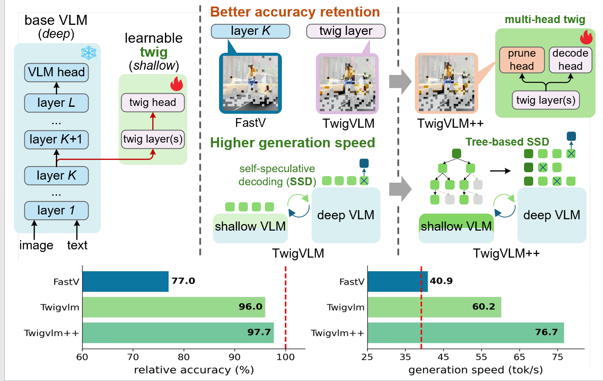
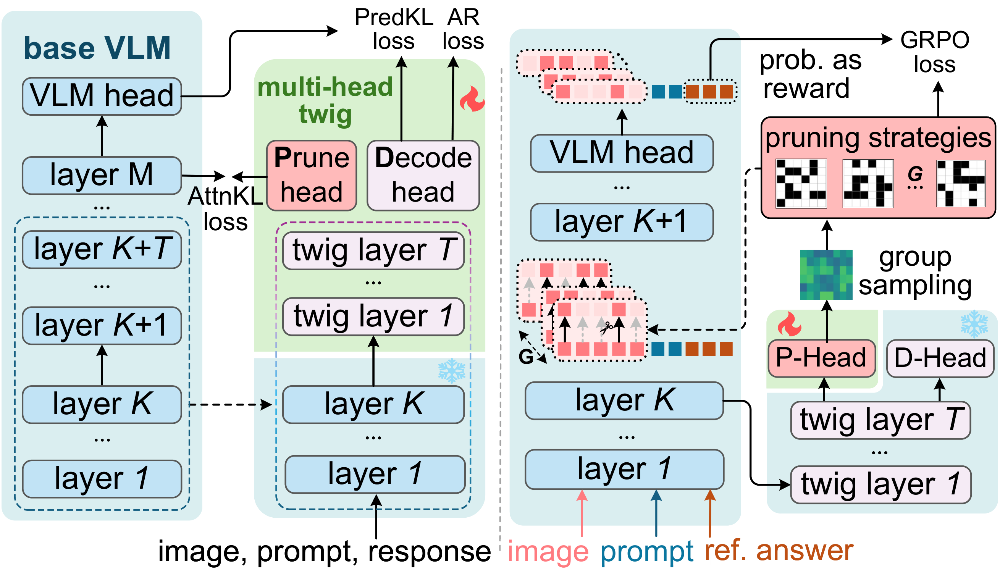

# TwigVLM++: Growing a Multi-head Twig via Distillation and Reinforcement Learning to Accelerate Large Vision-Language Models

This repository contains the official implementation of **TwigVLM** (ICCV 2025) and its extended variant **TwigVLM++** . TwigVLM is a general and effective framework that accelerates large vision-language models (VLMs) by "growing" a lightweight *twig* block upon an early layer of the base VLM. TwigVLM++ further extends this with a novel **multi-head twig architecture**, a **two-stage training paradigm** combining distillation and reinforcement learning, and a **tree-based self-speculative decoding** strategy.

<table align="center"><tr>
<td></td>
<td></td>
</tr></table>

## Overview

Most existing VLM acceleration methods are purely based on visual token pruning, and suffer from two key limitations:
1. **Accuracy drop**: Attention maps in early layers are insensitive to the task, leading to poor token selection quality.
2. **Limited decoding speedup**: Token pruning only accelerates the prefilling stage, but the decoding stage dominates inference time for long responses.

**TwigVLM** addresses both limitations in a unified framework:
- **Twig-Guided Token Pruning (TTP)**: Uses the attention map from the last twig layer (closer to the prediction head) to guide more precise token pruning.
- **Self-Speculative Decoding (SSD)**: The shallow twig model acts as a draft model, enabling parallel verification by the deep base model for accelerated generation.

**TwigVLM++** further improves upon TwigVLM by:
- **Multi-head Twig Architecture**: Decouples token pruning (P-Head) from next-token prediction (D-Head), enabling targeted optimization of each task.
- **Two-Stage Training Paradigm**: Stage 1 trains the twig block via distillation learning (NTP + PredKL + AttnKL losses); Stage 2 optimizes the pruning head via GRPO-style reinforcement learning with a dynamic pruning-ratio schedule.
- **Tree-based SSD**: Replaces the original sequence-based SSD with a token tree strategy, increasing accepted tokens per verification step for higher decoding throughput.
- TwigVLM++ outperforms TwigVLM by **+1.7% accuracy** and **+43% generation speed** under the same settings.

<!-- ### Key Results (LLaVA-1.5-7B, 88.9% token pruning)

| Method | RelAcc | Generation Speed |
|:------:|:------:|:---------------:|
| FastV | 77.0% | 40.9 tok/s |
| TwigVLM | 96.0% | 60.2 tok/s |
| **TwigVLM++** | **97.7%** | **77.3 tok/s** | -->


## Table of Contents

- [Prerequisites](#prerequisites)
- [Training](#training)
  - [Stage 1: Distillation Learning](#stage-1-distillation-learning)
  - [Stage 2: Reinforcement Learning](#stage-2-reinforcement-learning)
- [Evaluation](#evaluation)
- [Demo](#demo)
- [Results](#results)
- [License](#license)
- [About Us](#about-us)
- [Citation](#citation)

## Prerequisites

0. **Hardware requirements**: Training requires a server with **at least 4 GPUs**, each with **more than 40GB memory** (e.g., 8×NVIDIA A100). For inference or evaluation, **a single GPU with >40GB memory** is sufficient.

1. Clone this repository:
```shell
git clone -b twigvlm++ https://github.com/MILVLG/twigvlm.git
cd twigvlm++
```

2. Create and activate the conda environment:
```shell
conda create -n twigvlm++ python=3.10 -y
conda activate twigvlm++
pip install -r requirements.txt
pip install flash-attn==2.3.2 --no-build-isolation
```

> **Note**: **FlashAttention2** can only be applied during the training phase. Due to its incompatibility with tree-based speculative decoding, the inference stage must rely on the **eager** mode for execution.

3. Prepare the base model and training data. Download [LLaVA-1.5-7B](https://huggingface.co/liuhaotian/llava-v1.5-7b) and the [LLaVA-665K training data](https://github.com/haotian-liu/LLaVA?tab=readme-ov-file#visual-instruction-tuning) following the original [LLaVA project](https://github.com/haotian-liu/LLaVA). Set the paths in the training scripts accordingly.

## Training

TwigVLM++ uses a **two-stage training paradigm**. Only the lightweight twig block (and its heads) are trained while the base VLM is kept frozen, consuming only ~10% of the training time compared to training the full base model.

### Stage 1: Twig Training via Distillation Learning

In the first stage, the multi-head twig block (D-Head + P-Head) is trained using:
- **NTP loss** (L_NTP): Standard autoregressive next-token prediction loss
- **PredKL loss** (L_PredKL, α=0.1): KL divergence between the twig (draft) and base model's next-token prediction distributions. Improves alignment between shallow and deep models.
- **AttnKL loss** (L_AttnKL, γ=1.0): KL divergence between the base model's attention map (at a designated deep layer) and the P-Head's importance scores. Directly supervises the pruning signal.

Key hyperparameters:
- `twig_K=2`: Layer position where the twig block is inserted
- `twig_T=3`: Number of twig layers
- `A_B=19`: The deep layer index used for AttnKL supervision
- `D_ALPHG=0.1`: Weight for PredKL loss (α)
- `A_GAMMA=1.0`: Weight for AttnKL loss (γ)

```shell
bash scripts/v1_5/train/train_twig++_stage1.sh
```

The trained checkpoint is saved to `./checkpoints/TwigVLM++-stage1-llava1.5-7b-K2-T3` by default.

### Stage 2: Pruning Optimization via Reinforcement Learning

You can download stage2 datasets at [here]().

In the second stage, only the **P-Head** parameters are updated via GRPO-style reinforcement learning to directly maximize post-pruning model performance. This stage:
- Re-uses the SFT dataset from Stage 1 but only needs ~10% of training samples (50K)
- Samples G=32 pruning actions per training sample and computes group-normalized advantages
- Adopts a **dynamic pruning-ratio schedule** (R ∈ {64, 85, 107, 128, 149, 171, 192}) with a curriculum-based annealing strategy, enabling a single trained model to support different pruning ratios at test time

Key hyperparameters:
- `NUM_GROUPS=32`: Number of sampled pruning actions per sample (G)
- `MAX_STEPS=500`: Total RL training steps (~50K samples)
- `POWER=2.0`: Annealing speed parameter (p) for the curriculum schedule

```shell
bash scripts/v1_5/train/train_twig++_stage2.sh
```

The trained checkpoint is saved to `./checkpoints/TwigVLM++-stage2-llava1.5-7b-K2-T3` by default.

The trained TwigVLM model (above stage1 and stage2 checkpoints) is available at [stage1](https://awma1-my.sharepoint.com/:u:/g/personal/yuz_l0_tn/IQCmPEXJFa2PSa-U4id07TZ7AWfxSdeYh_1nHfH-Ff9wxjM?download=1) and [stage2](https://awma1-my.sharepoint.com/:u:/g/personal/yuz_l0_tn/IQAScfR3uwRVS4FSBbl_KCdxAWEYScXKw7l536SLr7HmVcA?download=1).
## Evaluation

Download the evaluation data by following [LLaVA's Evaluation.md](https://github.com/haotian-liu/LLaVA/blob/main/docs/Evaluation.md). Download [eval.zip](https://drive.google.com/file/d/1atZSBBrAX54yYpxtVVW33zFvcnaHeFPy/view?usp=sharing) and unzip it to `./playground/data/eval`.

All evaluation scripts accept `-R` to specify the **average number of retained visual tokens**.

**GQA** (visual reasoning):
```shell
CUDA_VISIBLE_DEVICES=0,1,2,3,4,5,6,7 bash scripts/v1_5/eval/gqa.sh -R 192

```

## Demo

To run an interactive demo with the TwigVLM/TwigVLM++ model:

```python
python cli_demo.py \
    --base-model liuhaotian/llava-v1.5-7b \
    --twig-block "TwigVLM-llava-v1.5-7b-K2-T3" \
    --twig-K 2 \
    --twig-T 3 \
    --R 64 \
    --image-file "./assets/image.png"
```

## Results

### Accuracy Comparisons on LLaVA-1.5-7B

| Method | GQA | MMB | MME | TextVQA | SQA | VQAv2 | RelAcc |
|:------:|:---:|:---:|:---:|:-------:|:---:|:-----:|:------:|
| *Upper Bound (576 tokens)* | 61.9 | 64.7 | 1862 | 58.2 | 69.5 | 78.5 | 100% |
| **Retain Averaged 192 Tokens (↓ 66.7%)** |
| FastV | 56.5 | 63.7 | 1786 | 57.3 | 69.5 | 74.6 | 96.5% |
| VisionZip | 59.3 | 63.0 | 1783 | 57.3 | 68.9 | 76.8 | 97.4% |
| TwigVLM | 61.2 | 64.0 | 1848 | 58.0 | 68.8 | 78.1 | 99.2% |
| **TwigVLM++** | **61.2** | **64.3** | **1868** | **58.0** | **69.2** | **78.2** | **99.6%** |
| **Retain Averaged 128 Tokens (↓ 77.8%)** |
| FastV | 53.0 | 61.4 | 1646 | 56.0 | 69.5 | 69.2 | 92.2% |
| VisionZip | 57.6 | 62.0 | 1762 | 56.8 | 68.9 | 75.6 | 96.1% |
| TwigVLM | 60.6 | 63.5 | 1818 | 57.8 | 69.5 | 77.9 | 98.7% |
| **TwigVLM++** | **60.8** | **63.7** | **1856** | **58.0** | **69.5** | **77.9** | **99.2%** |
| **Retain Averaged 64 Tokens (↓ 88.9%)** |
| FastV | 44.1 | 45.9 | 1218 | 50.7 | 70.0 | 52.0 | 77.0% |
| VisionZip | 55.1 | 60.1 | 1690 | 55.5 | 69.0 | 72.4 | 93.3% |
| TwigVLM | 58.8 | 60.4 | 1760 | 55.8 | 70.0 | 75.6 | 96.0% |
| **TwigVLM++** | **59.7** | **63.2** | **1801** | **56.7** | **69.5** | **76.8** | **97.7%** |

### Generation Speed Comparisons on LLaVA-1.5-7B

| Method | TextVQA (short) | MM-Vet (long) |
|:------:|:--------------:|:-------------:|
| LLaVA-1.5-7B | 27.8 tok/s | 39.8 tok/s |
| FastV (R̄=64) | 30.5 tok/s | 41.5 tok/s (104%) |
| VisionZip (R̄=64) | 30.4 tok/s | 41.5 tok/s (106%) |
| TwigVLM (R̄=64) | 29.2→**30.4** tok/s (128%) | **60.2 tok/s (154%)** |
| **TwigVLM++ (R̄=64)** | **33.0 tok/s (139%)** | **77.3 tok/s (197%)** |

### Results on Qwen2.5-VL-7B

TwigVLM++ substantially outperforms VisionZip on the stronger Qwen2.5-VL-7B model:

| Method | RelAcc (88.9% pruning) | RelSpd |
|:------:|:---------------------:|:------:|
| FastV | 76.7% | 104.3% |
| VisionZip | 88.4% | 107.1% |
| TwigVLM | 86.0% | 152.3% |
| **TwigVLM++** | **94.4%** | **193.2%** |

## License

This project is licensed under the Apache License 2.0 - see the [LICENSE](https://www.apache.org/licenses/LICENSE-2.0) file for details.

## About Us

This project is maintained by the [MILVLG](https://github.com/MILVLG) @ Hangzhou Dianzi University (HDU).

## Citation

If this work is useful in your research, please cite our papers:

```bibtex

@InProceedings{Shao_2025_ICCV,
    author    = {Shao, Zhenwei and Wang, Mingyang and Yu, Zhou and Pan, Wenwen and Yang, Yan and Wei, Tao and Zhang, Hongyuan and Mao, Ning and Chen, Wei and Yu, Jun},
    title     = {Growing a Twig to Accelerate Large Vision-Language Models},
    booktitle = {Proceedings of the IEEE/CVF International Conference on Computer Vision (ICCV)},
    month     = {October},
    year      = {2025},
    pages     = {20064-20074}
}
```
